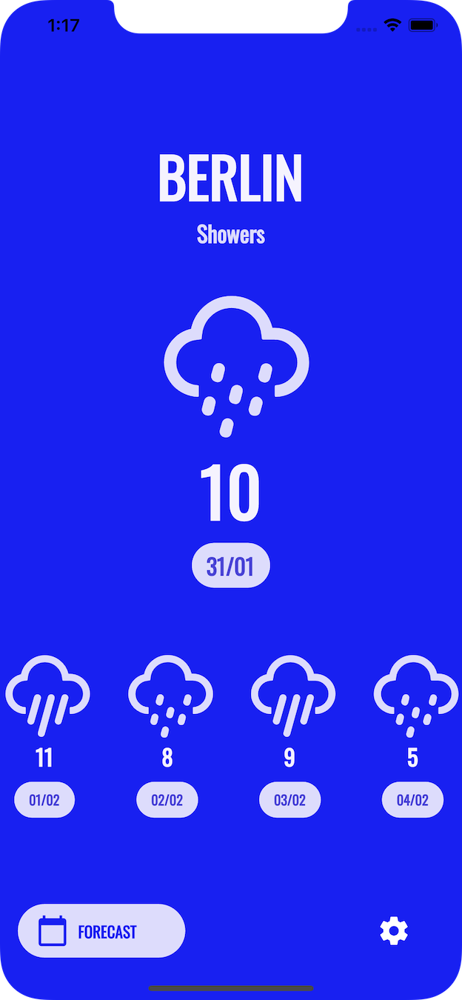
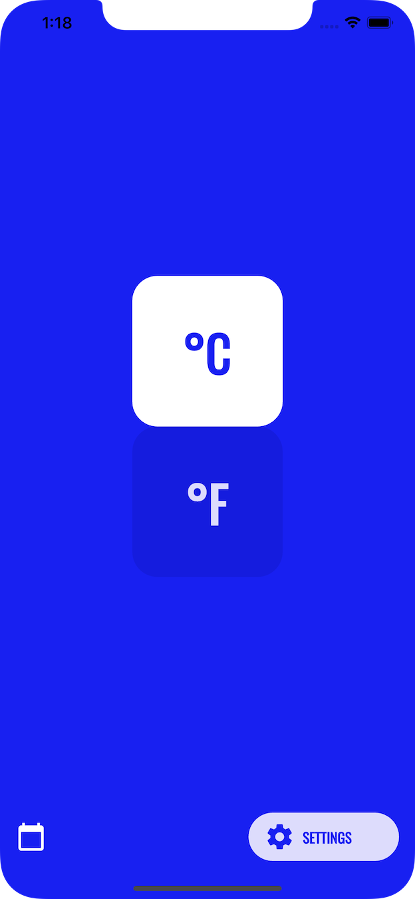
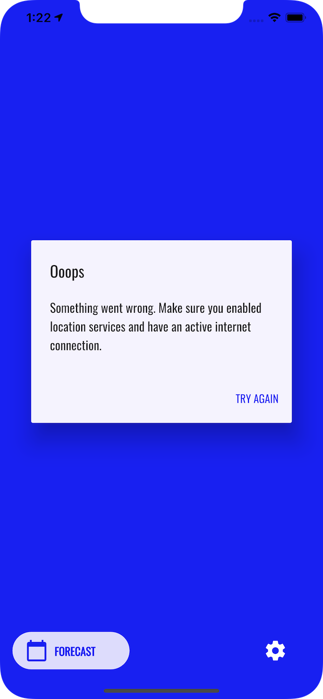
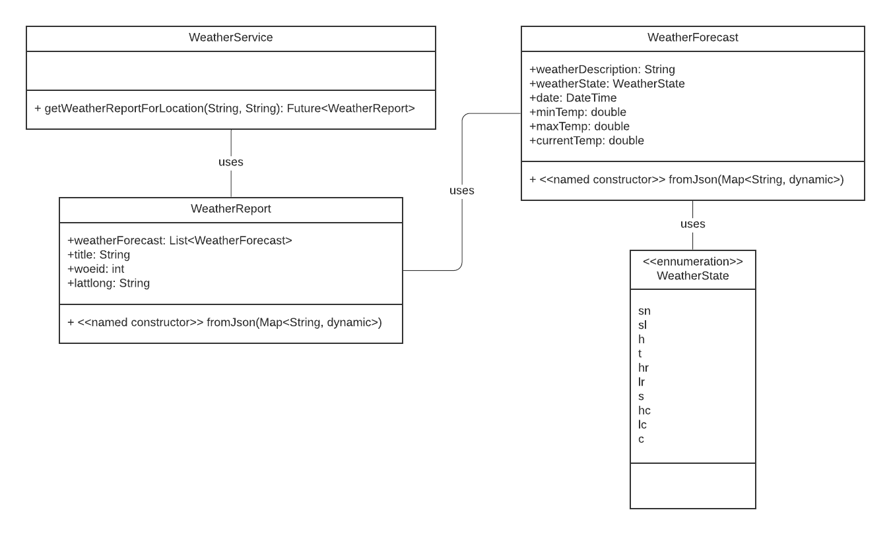
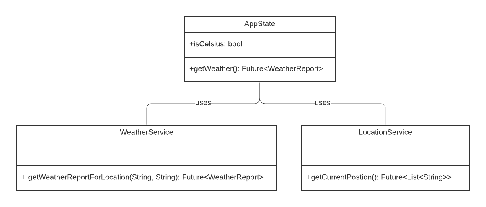

# weather

A simple weather app made with Flutter.

The app uses the device's location to get the current weather (and five day forecast). If an error occurs (no internet, location permission not granted), then a popup is displayed.

Design inspired by [Weather App Concept](https://dribbble.com/shots/7180398-Weather-App-Concept) by [Eddy Gann](https://dribbble.com/Ed117).

## Screenshots

|                             |                             |                             |
| ----------------------------| --------------------------- | --------------------------- |
|  |  |  |

## Class Diagrams

|                                   |                             |
| ----------------------------------| --------------------------- |
|  |  |

## Technical Info

- The app consists of one main screen `HomeScreen` containing a bottom navigation bar.
- This navigation bar shows either `WeatherScreen` or `SettingsScreen`.
    - On `WeatherScreen` displays the current weather forecast for the device's location.
    - On `SettingsScreen`, the user can choose between Celsius or Fahrenheit.
- `Provider` is used as the project's state management solution.
- `WeatherService` uses [MetaWeather Api](https://www.metaweather.com/api/).

